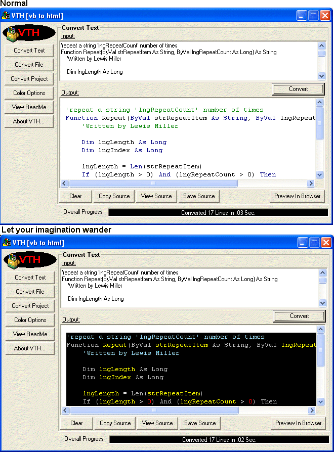



## VTH \- Visual Basic Source Code to Html Syntax Highlighting Converter

### Description

VTH is a vb code to html converter, its good for creating help file snippets with a colored background. See included read me for more info. Please post any code it wont process here.
 
### More Info
 

             |
---                |---
**Submitted On**   |2004-11-18 04:00:52
**By**             |[Deth](https://github.com/Planet-Source-Code/PSCIndex/blob/master/ByAuthor/deth.md)
**Level**          |Advanced
**User Rating**    |5.0 (45 globes from 9 users)
**Compatibility**  |VB 6\.0
**Category**       |[Complete Applications](https://github.com/Planet-Source-Code/PSCIndex/blob/master/ByCategory/complete-applications__1-27.md)
**World**          |[Visual Basic](https://github.com/Planet-Source-Code/PSCIndex/blob/master/ByWorld/visual-basic.md)
**Archive File**   |[VTH\_\-\_Visu18195911182004\.zip](https://github.com/Planet-Source-Code/deth-vth-visual-basic-source-code-to-html-syntax-highlighting-converter__1-57295/archive/master.zip)

